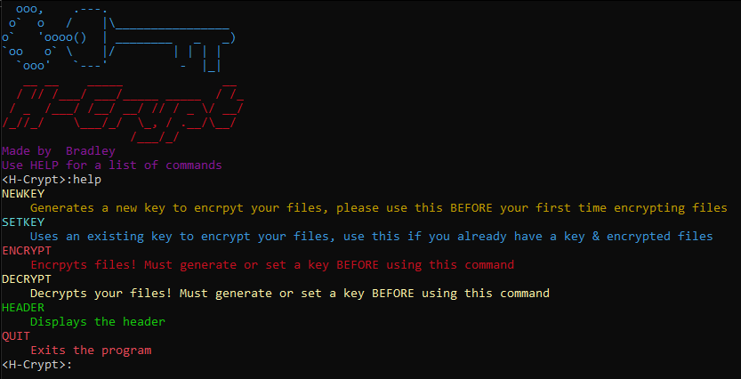

# H-Crypt
A simple file encryptor/decryptor to keep your files safe written in python.

Keep your keyfile on a flashdrive or write the key down to ensure no one accesses your files!

Note: You must place the key in the destination folder BEFORE encrypting or decrypting.

# Setup
Use [H-Crypt Setup.exe](https://github.com/2003HondaCivic/H-Crypt/blob/main/H-Crypt%20Setup.exe)

Alteratively use git clone and run [H-Crypt.exe](https://github.com/2003HondaCivic/H-Crypt/blob/main/H-Crypyt/H-Crypt.exe)
